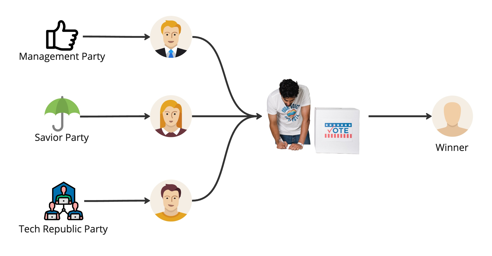

# Realtime Voting App

## Description
The Realtime Voting App simulates an election process by scraping data from the Random Person API to generate candidate profiles and conducting real-time voting analytics. This project showcases the integration of data scraping, real-time data processing, and interactive visualization.

## Features
- **Candidate Generation:** Dynamically creates candidate profiles using data from the Random Person API.
- **Real-time Voting Simulation:** Simulates an election with real-time vote casting and counting.
- **Data Analytics:** Provides real-time analytics and visualizations of voting results.

## System Architecture
The architecture follows a structured ETL pipeline:

1. **Data Scraping:** Extracts candidate data from the Random Person API.
2. **Data Storage:** Stores candidate profiles in PostgreSQL and vote data in Cassandra.
3. **Voting Simulation:** Generates and records votes in real time.
4. **Real-time Processing:** Uses Apache Spark Streaming to process incoming vote data.
5. **Visualization:** Displays results through a Streamlit dashboard.

### System Architecture Overview


### System Flow


## Components
### 1. Dockerized Infrastructure
The project uses Docker and Docker Compose for easy setup and deployment.


### 2. Streamlit Interface
The voting results and analytics are presented through a Streamlit dashboard.

#### Main Dashboard View


#### Candidate Profiles


#### Voting Analytics


## Technologies Used
- **Backend:** Python, Apache Spark Streaming
- **Databases:** PostgreSQL, Cassandra
- **Orchestration:** Docker, Docker Compose
- **Visualization:** Streamlit
- **Web Scraping:** Requests, BeautifulSoup

## Setup
### Prerequisites
Ensure you have the following installed:
- Python 3.x
- Docker & Docker Compose
- Apache Spark

### Installation Steps
1. **Clone the Repository:**
   ```bash
   git clone https://github.com/aymenesoualem/Realtime_voting_app.git
   cd Realtime_voting_app
   ```
2. **Set Up Docker Containers:**
   ```bash
   docker-compose up
   ```
3. **Install Python Dependencies:**
   ```bash
   pip install -r requirements.txt
   ```
4. **Run Data Scraping Module:**
   ```bash
   python main.py
   ```
5. **Start Voting Simulation:**
   ```bash
   python voting.py
   ```
6. **Run Real-time Processing:**
   ```bash
   python spark-streaming.py
   ```
7. **Launch Streamlit Dashboard:**
   ```bash
   streamlit run streamlit-app.py
   ```

## Future Enhancements
- Automate deployment using Terraform.
- Implement authentication for voter verification.
- Add a REST API for vote submission.

P.S: Inspiration for this project: https://www.youtube.com/watch?v=X-JnC9daQxE&t=5237s
